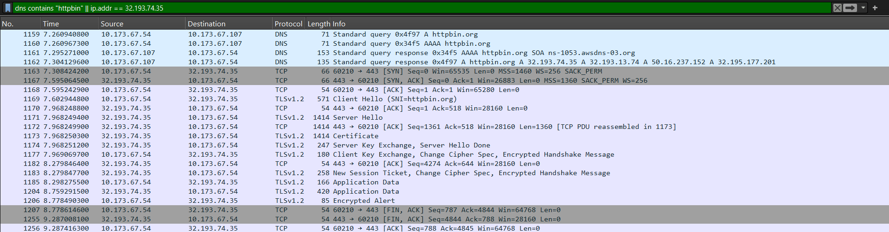

# Lab 0.1-Network Fundamentals
This lab required Wireshark to capture and annotate packets.
* The packet capture for step 1 of the lab can be found in [login-capture.pcapng](login-capture.pcapng).
* The packet capture for step 2 of the lab can be found in [wireshark-capture-step2.pcapng](wireshark-capture-step2.pcapng).
* The 200 word VPN vs ZTNA comparison can be found in [VPN vs. ZTNA QA.pdf](VPN_vs._ZTNA_QA.pdf)

## Wireshark Step 2 SS

## DevTools Response Code SS

## DevTools Request Headers (Authorization, Content-Type) SS
.png)

## DevTools Response Structure SS

