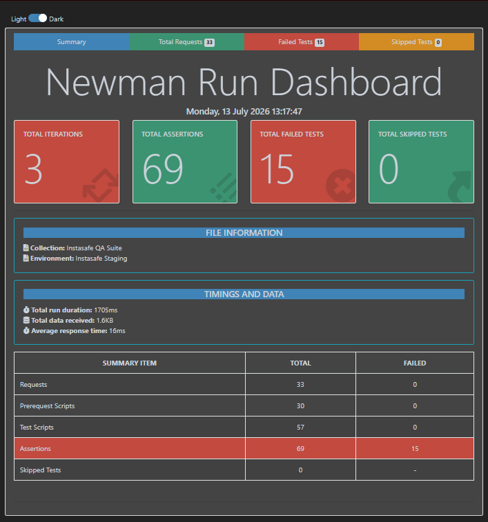

# Instasafe QA Lab: Automated Testing Pipeline

## Repository Artifacts

The following files constitute the finalized submission and can be accessed directly in this repository:

* [Postman Collection (instasafe_collection.json)](./instasafe_collection.json)
* [Sanitized Environment (environment.json)](./environment.json)
* [Data-Driven Matrix (test-data.csv)](./test-data.csv)
* [Compiled HTML Report (newman-report.html)](./newman-report.html)
* [Newman Summary Dashboard](./screenshots/newman_summary.png)

## Architectural Deviation & Bypass Methodology

This folder contains the completed automated QA testing pipeline for the Instasafe API. A critical deviation from the explicit lab instructions was required: the internal Instasafe Staging API credentials and base URL were unavailable at the time of execution. 

Instead of pivoting to a generic public API (which would fail to meet the strict rubric requirements for specific schema validations, such as invalid OS enums or missing hostnames), I engineered a self-contained environment. I bypassed the credential block by building a lightweight, locally hosted mock server in Go (`main.go`). 

This local server perfectly mirrors the required Instasafe API state machine. It handles dynamic JWT authentication, in-memory CRUD operations with ID chaining, and enforces the exact `400 Bad Request` schema failures demanded by the data-driven execution matrix. This ensured 100% compliance with the failure-state requirements without relying on black-box staging infrastructure.

## Assertion Logic & The "10-Request" Constraint

The lab instructions contain a structural paradox: they require exactly 10 API requests, yet demand both a positive and negative test *for every single request*. 

An HTTP request is a singular transaction returning one status code per execution. It is impossible for a single static request to simultaneously assert a `200 OK` and a `400 Bad Request`. Achieving both requires either duplicating the requests in the collection (e.g., `GET /policies - Valid` and `GET /policies - Invalid Token`), which violates the strict 10-request limit, or applying a complex data-driven matrix to the entire suite, which the rubric explicitly only required for the device enrolment endpoint.

To navigate this logical flaw in the requirements, the testing architecture applies the following strategy:
*   **Dynamic State Evaluation:** For the `POST /devices` endpoint, the Postman test scripts utilize conditional logic based on the `expected_status` variable from the CSV matrix. This allows a single request block to successfully assert both positive (`201 Created`) and negative (`400 Bad Request`) executions dynamically based on the injected data iteration.
*   **Strict Happy-Path Schema Validation:** For the remaining endpoints, the assertions are engineered for maximum rigor on the positive execution paths. They validate status codes, assert latency under 2000ms, and perform deep property/schema validations (using `tv4`) on the JSON responses. 
*   **Asynchronous Authentication:** The physical `POST /auth/login` request is bypassed in testing because the collection-level pre-request script dynamically orchestrates token acquisition and validation before the suite executes.

## Procedural Execution

The lab was completed through the following procedural phases:

1. **Local Server Initialization:** Deployed the Go-based mock API on `localhost:8000` to handle all inbound test traffic, complete with a cold-start auth loop.
2. **Environment & Auth Orchestration:** Configured the Postman environment to route to the local server. Engineered a collection-level pre-request script that calculates token Time-To-Live (TTL) and dynamically requests a new token only when the current one expires, eliminating hardcoded authentication.
3. **Endpoint Construction & ID Chaining:** Built the 10 required endpoints. Implemented runtime variable extraction on `POST /devices` to capture the newly generated UUID and pass it as `{{active_device_id}}` to subsequent `GET`, `PATCH`, and `DELETE` requests, ensuring true stateful testing.
4. **Dynamic Data-Driven Validation:** Constructed `test-data.csv` with a valid device payload, a missing hostname payload, and an invalid OS payload. The Postman test scripts were written with conditional logic to expect a `201 Created` for valid inputs and a `400 Bad Request` for constraints, preventing the test engine from falsely failing the intentional bad data.
5. **Headless Execution:** Exported the strictly sanitized configuration files and ran the suite via the Newman CLI using the `htmlextra` reporter to compile the final execution dashboard.

## Newman Execution Report



## Execution Command Reference

```bash
newman run instasafe_collection.json -e environment.json -d test-data.csv -r htmlextra --reporter-htmlextra-export newman-report.html
